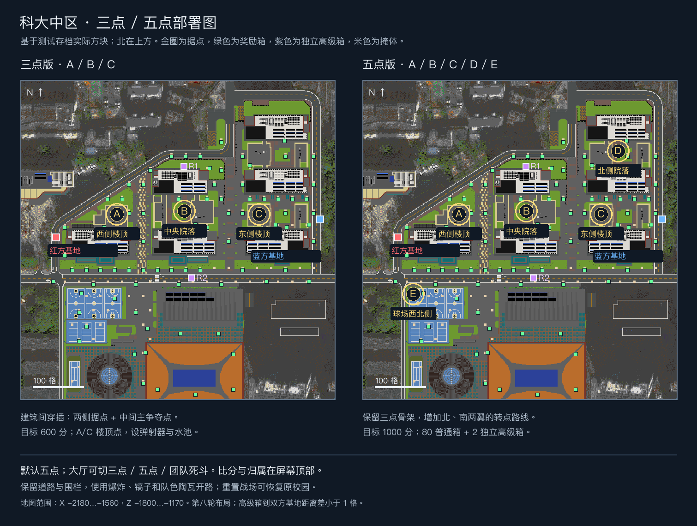

# 科大中区三点 / 五点布局

2026-09-21。`USTC_project` 保留原样；新增游戏元素在独立 `USTC_PVP_Field_26.2` 存档中。模式和顶部计分已接入。当前是第一版测试布局，尚未经过多人对战平衡。

| 标记 | 区域 | X / Y / Z | 三点 | 五点 |
|---|---|---|---|---|
| A | 西侧楼顶 | -1990 / 28 / -1535 | 开启 | 开启 |
| B | 中央院落 | -1857 / 2 / -1541 | 开启 | 开启 |
| C | 东侧楼顶 | -1710 / 29 / -1535 | 开启 | 开启 |
| D | 北侧院落 | -1676 / 2 / -1660 | 关闭 | 开启 |
| E | 球场西北入口一侧 | -2080 / 2 / -1378 | 关闭 | 开启 |
| 红基地 | 校园西侧 | -2110 / 2 / -1490 | 共用 | 共用 |
| 蓝基地 | 校园东侧 | -1590 / 2 / -1525 | 共用 | 共用 |
| 大厅 | 战场北侧平台 | -2130 / 9 / -1800 | 共用 | 共用 |

各点有金块核心、旗帜、地面标记和悬浮名称；名称及顶部 A–E 状态随归属更新。未启用的 D/E 保留实体地标但不参与三点计分；团队死斗停用所有据点。每个基地有三个复活位置与补给入口。

体育馆周围共 **8 个补给箱**，覆盖西北、北、东北、东、东南、南、西南、西侧；另有 72 个战地奖励箱，共 80 个。具体坐标见 `实际点位.json`。60 秒补充一次，体育馆额外保证手雷、破拆火箭、治疗和箭。

默认三点 600 分、五点 1000 分、死斗 60 分。占点与死斗独立；5 秒占领、中立化后再夺取，持有空点每秒 1 分，敌人进入停分。距离旗点 9 格以内，脚部高度限制为上下 3 格；圈内腹地正常跳跃 II 不会超出高度上限，高出 6 格的楼层不能占点。

按建筑 1:2 尺度，出生默认只给跳跃 II；速度改为箱子里的速度 II 45 秒药水。依用户决定，**不按绕路距离再搬动点位，不改造原道路和围栏来缩短路线**。玩家用爆炸、镐子和每条命 64 块队色陶瓦破坏、搭路，围绕可变地形对战。

恢复范围 X=-2144…-1569、Z=-1776…-1153、Y=-16…127。分批从私有模板维度恢复原校园，再重建游戏元素，清空分数并回基地；保持当前模式。大厅在范围外，重置期间留在大厅等待顶部进度完成。

新增 100 组可破坏掩体，战区 Y=-1 铺设基岩；具体位置见 `掩体与补给.json`，恢复时一起重建。每个奖励箱另提供破拆火箭与速度药水。

原候选图 `科大中区-三点与五点候选.png` 仅保留讨论记录，以本页、部署图及 `实际点位.json` 为准。

2026-09-23：A/C 已按楼顶方案实施，附弹射器、跳水平台和两格深水池。高级箱移至独立区域 (-1858,2,-1630)、(-1843,2,-1410)，双方基地直线距离差小于 1 格；所有点都有信标光柱。
