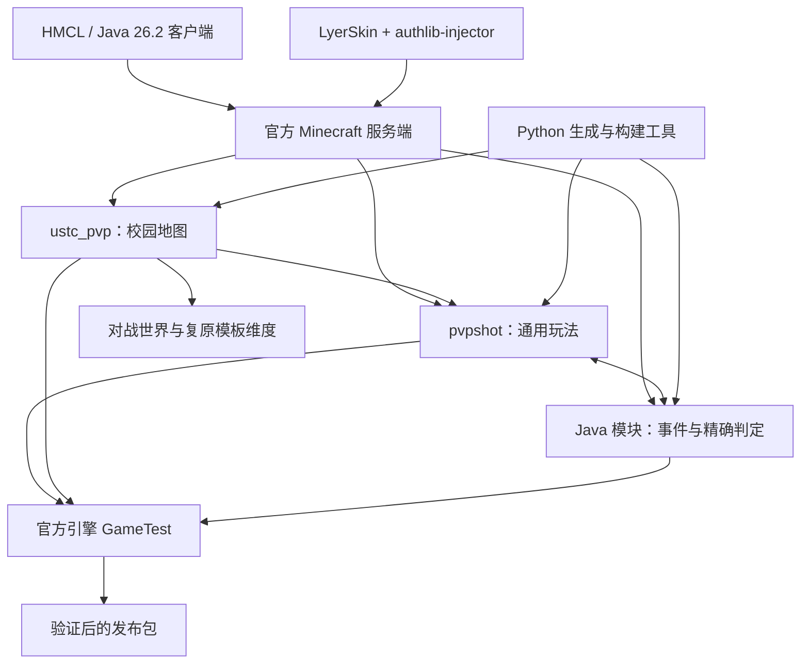

当前项目是 **Minecraft Java 26.2 官方服务端 + 两个数据包 + 自研 Java 服务端模块 + LyerSkin 认证模块**。玩法由服务器结算，客户端用 HMCL 启动对应版本并登录 LyerSkin 即可。当前发布版本为第八轮。

本说明依据 2026-09-23 的本地源码、发布验收记录，以及北京时间约 08:01–08:02 的线上只读查询整理。在线人数、资源占用和正在进行的模式是当时快照。本次没有修改玩法、重置世界或重启服务器。

**代码按职责分为以下部分。**

| 路径 | 职责 | 开发时的定位 |
|---|---|---|
| `pvpshot/` | 通用 PVP 数据包：物品、弹药、部分投射物、伤害、回血、模式、计分、部署结构 | 实际运行的数据包；很多文件由 Python 生成 |
| `ustc_pvp/` | 中区地图数据包：点位、基地、补给、前线复活、楼顶设施、保护区域、整场复原 | 将通用玩法接到校园地图 |
| `server_protection/src/` | Java 模块：原生事件拦截、设施保护、弓弩、SMG 连射、战斗机、温雷、霰弹枪、重武器等 | 实际名称仍叫 protection，职责已包含大量玩法 |
| `tools/` | Python 生成器、世界构建、发布打包、部署及状态查询；另有 Java 世界构建程序 | 开发和发布时运行，服务器日常游戏不依赖 Python |
| `tests/` | Java 官方引擎 GameTest、Python 测试入口、日志和验收记录 | 验证行为，而不只是检查文本语法 |
| `地图方案/` | 点位、补给、掩体规划及部署图 | 部分 JSON 是生成器输入，部分是生成结果 |
| `USTC_project/` | 原始校园存档 | 保留的原始素材，不直接作为开发测试世界改写 |
| `测试存档/`、`发布/` | 已构建测试世界、完整测试服、正式数据包、模块和校验清单 | 分发产物，不应作为长期修改入口 |
| `部署记录/` | 线上版本、备份位置及上线检查结果 | 追踪线上实际部署情况 |

当前两个数据包合计有 763 个 `.mcfunction` 文件：核心 208 个，校园包 555 个；校园包其中 3 个位于 `pvpshot` 命名空间，用于覆盖通用实现。大量文件是地图恢复批次等生成内容，不能按文件数量理解为同等数量的独立功能。



**两个数据包有明确的加载顺序和覆盖关系。**

`ustc_pvp/data/minecraft/tags/function/load.json` 依次调用 `pvpshot:load` 和 `ustc_pvp:load`；对应的 `tick.json` 每个游戏 tick 依次调用两个包的 tick 入口。正常目标为每秒 20 tick。

核心的 load 建立计分板、队伍、Bossbar、配置和武器状态；核心 tick 处理玩家、部署物、伤害区域、投射物、据点、胜负、箱子、弹药与回血。校园 load 检查世界是否准备完成、恢复保护开关、处理版本迁移；校园 tick 处理入队、公开指令、大厅、地图 UI、补给计时和掉落清理。

校园包覆盖以下三个核心函数，所以仅修改核心同名文件，在线上校园世界里可能不生效：

| 被覆盖的函数 | 校园实现 |
|---|---|
| `pvpshot:cfg/override` | 调用 `ustc_pvp:configure`，设置校园占点半径、补给周期等 |
| `pvpshot:player/spawn_location` | 调用 `ustc_pvp:respawn/location`，选择安全前线复活点 |
| `pvpshot:protection/check` | 使用校园保护区域 predicate 检查位置 |

发布世界按 `pvpshot`、`ustc_pvp` 的顺序启用，校园覆盖生效。不要重复安装同一包的文件夹和 ZIP。

**Java 模块通过服务器事件和数据包交换状态。**

它使用 Java 25 标准 Instrumentation / Class-File API，在类加载时插入调用；磁盘上的官方 `server.jar` 保持原文件。当前结构为：

| 类 | 负责内容 |
|---|---|
| `pvpshot.protection.ProtectionAgent` | `premain` 入口、官方 JAR SHA-1 核对、原生方法挂钩 |
| `pvpshot.protection.ProtectionRules` | 读取 `regions.tsv`；按区块索引保护区域；检查破坏、替换、爆炸、活塞等 |
| `pvpshot.protection.GameplayBridge` | 跨官方 bundler 的类加载器调用玩法实现 |
| `pvpshot.gameplay.GameplayRules` | 弓弩命中、近炸、风暴弹、温雷、战斗机、玩家 tick 和离线处理 |
| `pvpshot.gameplay.GameplayV8` | SMG 射速、单弩限制、盾牌迁移、霰弹枪、三种重武器、楼顶弹射器和增益清除 |

产物是两个 JAR：主 agent 包含挂钩与玩法实现，runtime JAR 提供共同可见的保护规则及桥接类。两者必须配套，保护区域由地图生成器统一生成。当前保护 181 个区域。

主要挂钩包括玩家 tick / 离线、世界 tick / 新实体加入、箭移动和命中、风弹爆炸、方块修改与破坏、挖掘、爆炸及活塞。数据包能把动作写入 scoreboard，Java 在 tick 中消费；Java 也能调用数据包函数。例如霰弹枪的使用事件先设置 `pvpshot.shotgun`，再由 Java 执行射线和伤害。

它依赖已验证的 26.2 原生类和方法，当前不是可以随意换版本的稳定插件 API。升级 Minecraft、换 Paper/Fabric 或修改挂钩，都需要重新适配和官方运行时验证。普通单人存档只复制两个数据包，不能得到完整第八轮玩法。

**运行状态主要存在 Minecraft 世界内，没有另外搭建数据库或业务 Web 服务。**

| 状态载体 | 用途 |
|---|---|
| scoreboard | 配置、比分、弹药、换弹、脱战时间、模式、重置进度、动作请求 |
| command storage | 结构化状态、函数宏参数、地图 prepared / balance_v8 等迁移标记 |
| marker / 实体标签 | 据点、复活候选、补给位置、部署物、弹体及其所有者 |
| 物品 components / custom_data | 武器身份、外观、冷却、耐久、药水及附魔参数 |
| Java 内存表 | 连射截止 tick、温雷状态、待执行炮击和投射物缓存等 |
| 世界存档 / 私有模板维度 | 地形、玩家数据和复原来源 |

Java 临时队列不是持久数据库；未完成重武器在换局、重置、使用者离线等情况下清理。需要跨区块或生命周期保留的部分数据，例如箭的发射位置，另写入实体标签。

**一局游戏的主线是入队、发装备、交战、复活、计分和结束。**

1. 玩家进大厅，通过按钮或 trigger 入红蓝队。每条命重新发装备：16 发无限备弹火焰弹、1 发破拆火箭、1 枚手雷、铁镐、64 块队色陶瓦，再随机雪球 4 枚 / SMG 48 发 / 三叉戟。
2. 生命 20 HP，饱食度持续补满。开火、投掷或交战会清除增益，保留安全缓降；脱战 5 秒开始快速回血；有效敌军伤害触发 2 秒全员可见发光。
3. 死亡通过死亡计数变化被识别。占领模式从己方已占点的候选位置中排除 24 格内有敌人、头部堵塞或脚下悬空的位置，再随机选取；没有合适点回基地。当前共有 30 个前线候选。死斗使用独立的分散候选规则。
4. 玩法依据当前模式计算比分并更新屏幕顶部 Bossbar。比赛结束后停止计分，保留结果，等待开新局或重置。

内部 `#mode` 为 0 时是死斗、1 时是占领；三点/五点由校园 `#preset` 区分。`#match.state` 为 0 时停止比赛逻辑、1 时进行中、2 时已结束。玩家 trigger 的 `set 1/3/5` 是面向用户的选项，不等于内部 `#mode` 编号。

| 模式 | 得分 | 胜利目标 |
|---|---|---|
| 三点占领 | A/B/C；占领后无人也每秒每点加 1 分；敌人进入停分；击杀不加占点分 | 600 |
| 五点占领 | A/B/C/D/E；规则同上 | 1000 |
| 团队死斗 | 击杀敌队玩家加 1 分；队友击杀不加分；据点不参与计分 | 60 |

中立据点占领需 5 秒，敌占点先中立化再占领，完整夺取需 10 秒。人数占优才推进，同人数冻结进度。占领判定半径 9 格、脚部高度偏差不超过 3 格，创造、旁观和死亡玩家不参与。A/C 是楼顶点，地面经过不会占领。胜负检查支持同 tick 同分到线的平局。

**武器有三条实现路径，继续开发时需要先选择路径。**

| 路径 | 现有例子 | 主要实现 |
|---|---|---|
| 数据包控制弹体 | 火焰弹、SMG、破拆火箭 | `item_display` 显示弹体，`shot/*` 每 tick 分 16 个小步扫描路径，结合所有者、碰撞、遮挡和自定义 damage_type 结算 |
| 原生投射物加服务端规则 | 弓弩、雪球、风暴弹、TNT、炮塔 | 保留对应原生实体，由数据包或 Java 补充距离、范围、伤害、区域和归属规则 |
| Java 直接控制射线或时序 | 霰弹枪、轨道 380、飞鹰 500、空爆火箭筒 | 精确射线、合并弹丸伤害、延时爆炸和世界 tick 队列 |

火焰弹保留弹匣与换弹逻辑，直击和范围不会对同一目标叠加。SMG 的按住右键发射由 Java 玩家 tick 控制，使用服务器游戏时间的独立 3 tick 截止，随后调用数据包生成弹体。弓使用原版曲线并增加远距近炸；弩维持直线速度、单把限制和远距致命阈值。TNT、航空炸弹和重型爆炸继续用原版爆炸结算，保留遮挡、自伤、友伤和伤害来源；破拆火箭另行控制低玩家伤害与大范围拆地形。

战斗机相当于一个限时装备状态：保存原胸甲 → 发鞘翅和有限弹药 → 起飞/战斗 → 30 秒到时或两种弹药耗尽 → 收走航空物品、恢复胸甲、缓降。温雷则是按住时开始计时、松开按剩余引信投出、超时原地爆炸。

完整伤害、冷却、弹量以 [武器平衡表](/Users/ltl/Desktop/PVP射击小游戏/武器平衡表.md) 为准。根目录旧 `说明.md` 仍有“出生破拆火箭 2 发”的残留，当前源码及第八轮发布实际为 **1 发**。

**地图复原与设施保护是两个相互配合的机制。**

保护模块在正常对战时阻止设施被破坏，但保留箱子交互、按钮状态变化和 TNT 对玩家的原版结算。普通建筑、玩家陶瓦及生成掩体可破坏。Y=-1 基岩是大地底层。

整场复原范围为 X=-2144…-1569、Z=-1776…-1153、Y=-16…127。它暂停比赛、让玩家回大厅、清理本轮弹体和部署物，从 `ustc_pvp:template` 私有维度分 **176 批**加载并复制地形，然后重建点位、基地、箱子、楼顶设施及掩体，保留模式选择并开新局。范围外搭建与原校园装饰实体不属于这套方块恢复范围。重置期间重复请求不会重新开始，结束后冷却 15 秒。

当前有 80 个普通补给箱，每 60 秒补货；2 个独立高级箱，每 300 秒补货，每次 25% 概率产生一件稀有装备，战斗机、轨道 380、飞鹰 500、空爆火箭筒各 6.25%。计时按服务器游戏 tick，空服暂停期间不继续倒计时。

| 设施 | XYZ |
|---|---|
| 红 / 蓝基地 | `-2110 2 -1490` / `-1590 2 -1525` |
| 大厅 | `-2130 9 -1800` |
| A / B / C | `-1990 28 -1535` / `-1857 2 -1541` / `-1710 29 -1535` |
| D / E | `-1676 2 -1660` / `-2080 2 -1378` |
| 北 / 南高级箱 | `-1858 2 -1630` / `-1843 2 -1410` |

战场和大厅的掉落物采用三层处理：关闭常规掉落规则、Java 拦截掉落实体生成、数据包清理已有掉落。主动丢弃的装备也会消失。

**线上服务器信息如下。**

| 项目 | 当前核对结果 |
|---|---|
| 玩家入口 | `<服务器IP>:28898`，TCP，校园网状态查询成功 |
| SSH | `ssh -p 26622 <ssh用户>@<服务器IP>` |
| 服务根目录 | `/home/<ssh用户>/pvpshot-campus-26.2` |
| 系统 | Ubuntu 24.04.4 LTS，Linux 6.8.0-137-generic，x86_64 |
| CPU | AMD Ryzen 9 9950X，16 核 / 32 线程；这是宿主机资源，并非本服独占配额 |
| 系统内存 | 约 30 GiB；查询时 available 约 3.4 GiB |
| Swap / 磁盘 | Swap 8 GiB，已用约 6.9 GiB；文件系统 936 GiB，剩余约 400 GiB |
| Java | OpenJDK 25.0.4.1 |
| Minecraft | 官方 Java 26.2，协议 776，数据包 107.1 |
| Java 堆 | `-Xms512M -Xmx3G`，由 `manage.sh` 启动时设置 |
| Java 进程常驻内存 | 查询时 RSS 约 1.69 GiB；不是 Java 堆已用值 |
| 玩家上限 / 距离 | 12 人；视距 8，模拟距离 6 |
| 世界 / 游戏设置 | `level-name=world`，生存、普通难度、PVP 开启、原版出生保护 0 |
| 认证 | LyerSkin：`https://auth.lylighte.cc/skinapi`；authlib-injector 1.2.8 |
| 在线验证 | `online-mode=true`，`enforce-secure-profile=true`；当前需要 LyerSkin 会话 |
| 访问控制 | 白名单关闭；RCON、Query 和 management-server 关闭；玩法按钮/trigger 对所有人开放 |
| 运维方式 | 独立 tmux socket `pvpshot-campus`，会话 `campus`；未配置本服开机自启 |
| 空服行为 | 60 秒后暂停模拟，进程继续监听 |
| 看门狗 | `max-tick-time=60000`，未关闭 |
| 日志 | `logs/latest.log`；GC / safepoint 日志 `logs/jvm-gc.log`，3 个轮转文件、单个 8 MiB |
| 当前版本 | 第八轮，2026-09-23 07:37 北京时间上线，部署校验 866 个代码文件 |
| 查询时模式 | **团队死斗，比赛进行中，未在重置**；不是旧运维说明中的五点模式 |
| 查询时人数 | 1 / 12 |
| 查询时 tick | 目标 20 tick/s；最近 100 个 tick 平均 2.0 ms，P95 2.3 ms、P99 4.9 ms |

这次 tick 结果来自单人在线快照，不代表 12 人激烈交战、重武器集中爆炸或整场复原时的性能。宿主机可用内存较少、Swap 使用较高是实测现象，但仅凭 Swap 已用量不能断言正在频繁换页或解释卡顿。以前发生过一次看门狗终止，已有记录的可能诱因为宿主机 I/O / 内存压力，唯一根因尚未确认。

公开 trigger 只开放既定玩法操作，不等于给所有人 Minecraft OP。现有设施保护仍开启。其他服务使用的 25565 端口未改动；校外连通性没有本次实测证据。需要给玩家发连接信息和认证地址，SSH 登录凭据不放进玩家教程或发布包。

线上目录主要包括：

```text
/home/<ssh用户>/pvpshot-campus-26.2/
├── server.jar / server.properties / eula.txt
├── start.sh / manage.sh
├── auth/authlib-injector-1.2.8.jar
├── protection/                 两个玩法模块 JAR + regions.tsv
├── world/
│   ├── datapacks/pvpshot/
│   ├── datapacks/ustc_pvp/
│   └── dimensions/ustc_pvp/template/
├── logs/
├── backups/
├── updates/                    更新包、迁移验证及暂存内容
└── release/                    历史初装材料；不应仅凭目录名判断为最新版本
```

最近第八轮更新前的完整备份为：
`/home/<ssh用户>/pvpshot-campus-26.2/backups/balance-v8-20260922T233718Z/`。
其中 `world-before.tar.gz` 保存当时世界。部署时更新代码并局部迁移设施，没有用测试世界替换线上世界。

常用管理命令如下；`start` 只是提交启动，仍需确认新日志中的 `Done` 和端口响应。`stop` 会正常保存，最多等待 60 秒，超时不强杀。

```bash
ssh -p 26622 <ssh用户>@<服务器IP>
cd /home/<ssh用户>/pvpshot-campus-26.2
./manage.sh status
./manage.sh command 'list'
./manage.sh command 'tick query'
./manage.sh check
./manage.sh stop
./manage.sh start
```

模式和复原操作会改变正在进行的比赛，开发检查时不应把它们当成只读命令：

```bash
./manage.sh command 'function ustc_pvp:preset/three'
./manage.sh command 'function ustc_pvp:preset/five'
./manage.sh command 'function ustc_pvp:preset/deathmatch'
./manage.sh command 'function ustc_pvp:reset/start'
./manage.sh command 'function ustc_pvp:protection/repair'
```

**继续开发时，先按修改目标定位源码。**

| 要修改的东西 | 优先入口 | 还需同步检查 |
|---|---|---|
| 火焰弹 / 破拆火箭的路径、命中 | `tools/build_rifle.py` 和 `pvpshot/.../function/shot/` | 第七/八轮覆盖、弹药、伤害归属、物品描述 |
| 雪球区域、基础装备与副武器 | `tools/build_field.py`，`kit/`、`roll/` | 第八轮伤害覆盖、箱子投放数量 |
| 第八轮物品、药水、盾牌、弹量 | `tools/build_balance_v8.py` | Java 内对应常量、loot table、说明与测试 |
| 弓弩、温雷、战斗机 | `GameplayRules.java`，以及 `build_balance_v7.py` 的相关定义 | 第八轮 overlay、Java 生命周期、客户端同步参数 |
| SMG 节奏、霰弹枪、重武器 | `GameplayV8.java` | 物品生成器中的标识/冷却/描述、动作 scoreboard |
| 炮与炮塔结构 | `tools/build_structures.py` | 第八轮发射次数、结构 NBT、四个朝向和保护检查 |
| 大型掩体 | `tools/build_balance_v8.py` | 模板尺寸、整个占用体积的检查、奖励箱入口 |
| 点位、基地、保护区域、重置范围 | `tools/ustc_world/make_pack.py` | `regions.tsv`、marker、模式、复活候选、整场重置 |
| A/C 屋顶、高级箱、旧世界迁移 | `tools/ustc_world/balance_v8.py` | 屋顶常量与 POINTS 一致、旧设施移除、版本标记 |
| 掩体与普通补给布局 | `地图方案/掩体与补给.json`、`tools/ustc_world/plan_cover.py` | 可达性、箱子保护、地图构建验证 |
| 得分和胜负 | `pvpshot/.../function/match/`、`point/`、`player/on_kill` | 三点/五点/死斗分别验证；校园 preset 的目标覆盖 |

有些文件直接维护，有些由脚本生成；当前还不是完全统一的单一配置驱动项目。修改前用 `rg` 搜索同一参数和写文件逻辑，确认最终由谁写入。已有“基础生成器 → 第七轮 → 第八轮”的覆盖顺序，单独重跑旧生成器会恢复旧值。只改 `发布/` 内副本会与源码脱节。新增改动也不要只放在 `/tmp` 临时脚本里。

建议按以下顺序推进一项功能：

1. 写清触发方式、伤害、射程、冷却、弹量、遮挡、友伤、掉线/死亡/换局时如何清理；先确认它走哪条武器实现路径。
2. 修改对应生成器或 Java 实现；生成的数据包与源生成器同步。地图设施变化要同时改保护、复活、恢复和旧世界迁移。
3. 运行相关官方引擎专项。伤害测试区分无甲基准和盾牌/护甲/抗性；连射或限时功能按真实服务器 tick 检查。
4. 在独立本地测试服连接 HMCL 实测操作、粒子和延迟手感。Java 代码改动必须重建 JAR 并重启；数据包修改可以 `/reload`，但当前 load 会重开比赛，物品组件变化也要重新领物品。
5. 生成独立新世界或迁移测试副本，打包并核对数据包、模块、世界内副本与 SHA256 一致，再更新平衡表和部署记录。
6. 上线前正常停服备份；替换准确的代码集合，删除已废弃的旧函数/advancement，保留认证、端口和已游玩的世界。重启后核对新日志、端口、模式、设施与迁移状态。

新增一把武器通常需要：loot table 中的唯一 `pvpshot.weapon` 标识、使用事件/函数或 Java 按住使用逻辑、伤害路径、弹量与冷却、补给/测试装备入口、换局清理、对应 GameTest 以及玩家说明。伤害继续交给原生伤害 API 或 `/damage`，保持护甲、盾牌、友伤和归属；不要直接改玩家 Health 代替伤害结算。

**以下命令是继续开发的入口，本次仅核对脚本参数，没有执行重建。** 在项目根目录执行；使用新临时目录，保留原始校园、线上世界与已有玩家存档。当前本机磁盘只剩约 1.4 GiB，重新导出/打包世界前需要先安排空间。

```bash
cd '/Users/ltl/Desktop/PVP射击小游戏'
PVP_JAVA_HOME='/Users/ltl/Library/Application Support/hmcl/java/macos-arm64/mojang-java-runtime-epsilon/jre.bundle/Contents/Home'
PVP_DEV_DIR="$(mktemp -d /tmp/pvpshot-dev.XXXXXX)"
PVP_SERVER_JAR="$PWD/发布/测试服务端/server.jar"
```

按本次修改选择需要的生成步骤。若重跑基础生成器，后面必须重应用第七、八轮覆盖；这是一组有覆盖顺序的脚本，不是已经统一成一个命令的完整构建系统：

```bash
python3 tools/build_rifle.py
python3 tools/build_field.py
python3 tools/build_structures.py
python3 tools/build_balance_v7.py
python3 tools/build_balance_v8.py
python3 tools/ustc_world/make_pack.py
```

编译模块，然后运行相应专项；`--suite` 可选 `weapons`、`rifle`、`field`、`modes`、`protection`、`balance`、`revision8`：

```bash
python3 server_protection/build.py \
  --java-home "$PVP_JAVA_HOME" \
  --server-jar "$PVP_SERVER_JAR" \
  --output "$PVP_DEV_DIR/agent"

python3 tests/run_gametests.py \
  --java-home "$PVP_JAVA_HOME" \
  --server-jar "$PVP_SERVER_JAR" \
  --work-dir "$PVP_DEV_DIR/tests" \
  --suite revision8 \
  --protection-agent "$PVP_DEV_DIR/agent/pvpshot-protection-26.2.jar"
```

涉及地图、设施或重置时，用官方引擎构建、验证并导出独立世界：

```bash
python3 tools/ustc_world/build.py \
  --java-home "$PVP_JAVA_HOME" \
  --server-jar "$PVP_SERVER_JAR" \
  --work-dir "$PVP_DEV_DIR/map" \
  --output "$PVP_DEV_DIR/export" \
  --protection-agent "$PVP_DEV_DIR/agent/pvpshot-protection-26.2.jar"
```

构建输出路径不得预先存在。完整发布到新的目录，脚本会检查官方 JAR 以及源码与世界中数据包的一致性：

```bash
python3 tools/package_release.py \
  --world "$PVP_DEV_DIR/export/USTC_PVP_Field_26.2" \
  --server-jar "$PVP_SERVER_JAR" \
  --protection-dir "$PVP_DEV_DIR/agent" \
  --output "$PVP_DEV_DIR/release"
```

此通用打包脚本生成完整测试服和正式代码，不等于自动升级线上服，也不会把线上 LyerSkin 配置自动装进通用分享包。分发模板 EULA 保持 false；现有线上 EULA 已经由用户明确同意。测试存档单独 ZIP 和本地目录的最终同步也应纳入发布核对，不应只更新一个压缩包。

现有 `tools/remote_server/deploy_release.py` 面向首次安装，会拒绝覆盖已有世界；不能拿它直接更新当前线上世界。第八轮的增量部署包含完整备份、线上副本迁移验证和逐文件校验，记录保存在 `部署记录/第八轮部署-2026-09-23.json` 及服务器 `updates/`。后续若继续频繁上线，值得把这套增量流程整理成仓库内固定入口。

**当前验收证据及后续工程优先级。**

第八轮已有 8 组官方引擎验收全部通过，日志合计 1131 条 PASS 检查记录；这是检查记录数，不是 1131 个独立测试用例。包括武器、火焰弹、雪球区域、独立模式、设施保护、前轮功能回归、第八轮专项，以及校园构建/176 批复原。完整复原错误数为 0。线上世界副本迁移、866 个部署文件校验和校园网端口查询也已通过。对应证据在 [第八轮验收记录](/Users/ltl/Desktop/PVP射击小游戏/tests/第八轮验收-26.2.json) 与 [第八轮部署记录](/Users/ltl/Desktop/PVP射击小游戏/部署记录/第八轮部署-2026-09-23.json)。

现阶段多人对战平衡、不同网络延迟下的手感、满员重火力压力和 Windows 启动实跑仍没有等同程度的验收证据。后续工程整理优先做：建立 Git 版本记录；统一武器参数来源与生成顺序；把临时发布/增量部署流程收进仓库；同步旧说明。随后按武器、载具、重武器和地图移动拆分 Java 实现，避免继续向两个大类追加所有功能。这些是建议，尚未实施。
